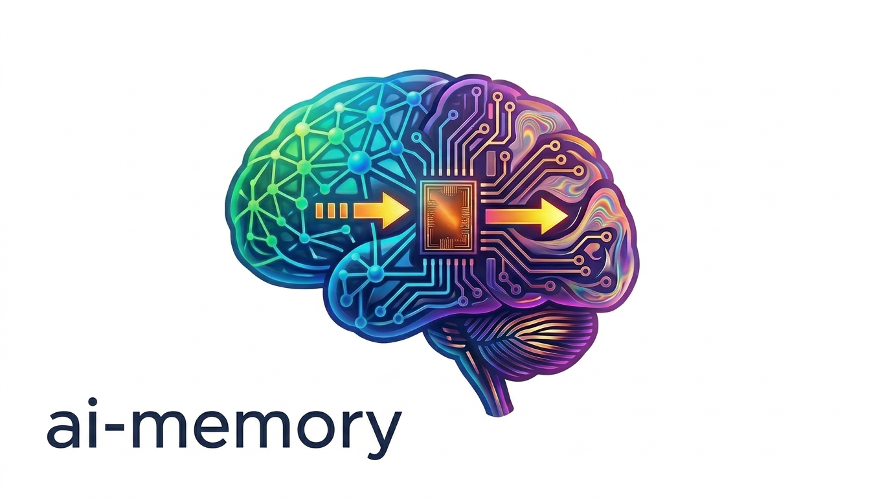

<p align="center">
  <picture>
    <source media="(prefers-color-scheme: dark)" srcset="docs/logo-dark.png">
    
  </picture>
</p>

> Long-term memory for AI coding agents. Quit Claude Code mid-task,
> start OpenAI Codex in the same directory, continue without
> re-explaining the architecture, the failed approaches, or the open
> questions.

[](docs/ARCHITECTURE.md)
[](rust-toolchain.toml)
[](LICENSE)

## Support Matrix

| Area | Status | Notes |
|---|---|---|
| Linux | Supported | Primary Docker/server target and CI platform. |
| macOS | Supported | Workspace tests run in CI; native source builds are supported. |
| Windows via WSL2 | Supported | Use the Linux install path inside WSL2 when the agent runs there. |
| Native Windows | Experimental | PowerShell wrapper and `.ps1` hooks are available; real agent harness feedback still needed. See [`docs/windows.md`](docs/windows.md). |
| Claude Code | Supported | MCP config + lifecycle hooks. |
| Codex | Supported | MCP config + lifecycle hooks. |
| OpenCode | Supported | Remote MCP config + generated TypeScript plugin. |
| Cursor | Supported | MCP config + lifecycle hooks. |
| Gemini CLI | Supported | MCP config + lifecycle hooks. |
| Oh My Pi / OMP | Supported | `pi` / `omp` aliases for MCP config + TypeScript extension. |
| Claude Desktop | MCP-only | Uses `mcp-remote`; no lifecycle hooks. |
| OpenClaw | Supported | MCP config + native plugin lifecycle hooks. |
| Antigravity CLI | Supported | MCP config (`serverUrl`) + lifecycle hooks (`agy` alias). |
| LLM providers | Supported | Anthropic, OpenAI, Gemini, and OpenAI-compatible endpoints. |
| Embedding providers | Supported | OpenAI, Voyage, and Google Gemini. |

## What it is

LLM coding agents lose all context when a session ends. ai-memory
gives them a shared, persistent wiki: every prompt, tool call, and
decision is captured automatically; when a session ends, the relevant
pages get rewritten as a coherent narrative; when the next agent
starts (Claude Code, Codex, OpenCode, …) it sees a handoff with
"where you left off" already prepended.

The wiki is plain markdown in a git repo - `grep`-able, openable in
Obsidian, backed up with `rsync`. No vector database to babysit, no
`write_note` ceremony, no manual context-loading. The full design is
in [`docs/ARCHITECTURE.md`](docs/ARCHITECTURE.md); the influences and
priors are at the [bottom](#influences-and-prior-art).

## Key features

- **Zero-friction capture.** Lifecycle hooks fire-and-forget every
  prompt + tool call + session boundary. You never type `write_note`.
- **Cross-agent handoffs.** Quit Claude Code mid-task, start Codex
  in the same directory hours later - the next agent sees a
  "where you left off" block before its first prompt.
- **Per-project isolation by construction.** Each project lives at
  `<wiki_root>/<workspace_id>/<project_id>/…` keyed by stable UUIDs.
  By default `workspace = "default"` and `project = basename($cwd)`.
  Drop a [`.ai-memory.toml` marker file](docs/marker-file.md) in any
  ancestor directory to override either or opt into repo-root project
  identity — perfect for multi-client consultancies, work/personal split,
  mono-repos, or linked git worktrees.
  Same page path can exist in two projects without collision; a
  rename is one column update; a purge is one `rm -rf`.
- **Karpathy-style LLM wiki.** Pages are compiled from observations
  at session-end (or PreCompact), not retrieved over raw logs.
  Supersession chain + git-versioned markdown means you can
  time-travel with `git log`.
- **Built-in `/web` browser.** Read-only HTML UI for the wiki -
  project list, folder tree, FTS5 search, markdown rendering, dark
  mode. Mounted on the same axum server as MCP.
- **Multi-agent + multi-machine ready.** Supported clients: Claude
  Code, Codex, OpenCode, Cursor, Claude Desktop (via `mcp-remote`),
  Gemini CLI, Antigravity CLI, OpenClaw, and Oh My Pi / OMP
  (`pi` / `omp` aliases).
  Server runs local (loopback) OR on a homelab box (LAN/VPN/cloud)
  with bearer-token auth.
- **Thin-client CLI.** `ai-memory bootstrap`, `purge-project`,
  `rename-project`, `lint`, `embed`, `forget-sweep`, `backup` are
  all HTTP clients of the running server - never touch SQLite or
  wiki files directly. Server is the single source of truth.
- **LLM is opt-in.** Zero-LLM mode still gives you FTS5 search +
  rule-based summarisation. Add a provider when you want consolidated
  pages and lint contradictions.

## Use cases

- **"Quit at 4 PM, pick up at 9 AM in a different agent."** The
  classic. SessionStart hook in the next agent (any of the
  supported CLIs) prepends a typed handoff with the open questions,
  next steps, and a session summary.
- **"What did we decide about X six weeks ago?"** Type
  `memory_query X` from the agent (or `ai-memory search X` from a
  terminal) - FTS5 over the wiki. Pages are LLM-consolidated, so
  the hit is a coherent decision page, not a raw chat log.
- **"This new project has months of history before ai-memory."**
  `cd /path/to/my-project && ai-memory bootstrap` collects
  `git log`, README, `docs/`, module headers, project rules and
  one-shot-summarises them into seed wiki pages. Future sessions
  build on top.
- **"Run one ai-memory for the whole household."** Stand the server
  up on a homelab box at `0.0.0.0:49374` with a bearer token; every
  laptop/desktop talks to it. Per-cwd routing keeps each project's
  pages cleanly separated; the `/web` UI is reachable from a
  browser anywhere on the LAN.
- **"Audit what landed before sharing with a teammate."** Browse
  the wiki at `http://<server>:49374/web` - HTTP Basic dialog if
  auth is on, paste the token as password. Per-project tree view,
  rendered markdown, supersession chain visible per page.
- **"Drop an experiment, keep the rest."**
  `ai-memory purge-project --project experimental --confirm`.
  Atomic: that project's DB rows cascade away, its wiki subdir gets
  `rm -rf`'d, every sibling project is untouched by construction.

## Quick start

You need: Docker + an agent CLI (Claude Code, Codex, OpenCode, OMP, Cursor,
Antigravity CLI, or anything else that speaks MCP).

The default quick-start has **no authentication** - the server binds
to loopback only, so on a single-user laptop nothing else can reach
it. Adding a bearer token is a one-line change once you're ready to
expose the server on the LAN; see [Security](#security) below.

```bash
# 1. Install the ai-memory CLI wrapper (a ~3 KB shell script that
#    runs the binary inside docker with your $HOME mounted). This is
#    the only thing that needs to live on the host filesystem.
mkdir -p ~/.local/bin
curl -fsSL https://raw.githubusercontent.com/akitaonrails/ai-memory/main/bin/ai-memory \
    -o ~/.local/bin/ai-memory
chmod +x ~/.local/bin/ai-memory
# Most distros put ~/.local/bin on PATH automatically. If `which
# ai-memory` comes up empty, add this to ~/.bashrc / ~/.zshrc:
#     export PATH="$HOME/.local/bin:$PATH"

# 2. Start the server. `--restart unless-stopped` makes it come back
#    on docker daemon restart and on machine boot (provided your
#    docker service is enabled at boot — `sudo systemctl enable
#    docker` on most distros). Loopback-only bind (`127.0.0.1:49374`)
#    so nothing outside this machine can reach it. Omit the LLM /
#    EMBEDDING lines for zero-LLM mode — FTS5 search still works
#    without any keys.
docker run -d --name ai-memory \
    --restart unless-stopped \
    -p 127.0.0.1:49374:49374 \
    -v ai-memory-data:/data \
    -e AI_MEMORY_LLM_PROVIDER=anthropic \
    -e ANTHROPIC_API_KEY=sk-ant-... \
    -e AI_MEMORY_EMBEDDING_PROVIDER=openai \
    -e OPENAI_API_KEY=sk-... \
    akitaonrails/ai-memory:latest

# 3. Wire your agent CLI in two commands. The wrapper takes care of
#    mounts + auto-detecting ~/.claude/settings.json. Re-run with
#    `--agent codex`, `--agent opencode`, `--agent gemini-cli`,
#    `--agent omp`/`pi`, `--client cursor`, `--client gemini-cli`, etc.
#    for additional agents; full list in docs/install.md.
ai-memory install-mcp   --client claude-code --apply
ai-memory install-hooks --agent  claude-code --apply
```

On Linux/macOS, that's it. Start a Claude Code session as usual - every
prompt and tool call now lands in ai-memory, and the next session you
open in this project will see a handoff with where you left off.

The `install-mcp` / `install-hooks` commands default to
`http://127.0.0.1:49374` (matching the server above) and no bearer
token. Both are idempotent - re-runs replace ai-memory's entry,
preserve every other server / hook you have configured, and write a
timestamped `.bak-<ts>` next to the file before each modifying
write. The hook scripts are staged into
`~/.local/share/ai-memory/hooks/<agent>/` automatically; re-running
overwrites them so future image updates ship updated hooks. Drop
`--apply` to print the snippet instead of mutating.

### Install Notes

- **Windows:** use the Linux path inside WSL2, or the native PowerShell
  wrapper and `.ps1` hooks for native Windows agents. Do not mix path
  worlds. See [`docs/windows.md`](docs/windows.md).
- **Docker compose:** `docker compose -f docker/docker-compose.yml up -d`
  is supported; agent setup is the same as step 3 above.
- **Remote server:** set `AI_MEMORY_SERVER_URL=http://<server-ip>:49374`
  on the client and pass matching `--server-url` flags when installing
  MCP/hooks. Any non-loopback server should use bearer auth.
- **Upgrades:** run `ai-memory upgrade` to refresh the wrapper, image,
  and staged hook scripts. Redeploy remote servers separately.

For Codex, OpenCode, OMP, Cursor, Claude Desktop, Gemini CLI, Antigravity CLI,
OpenClaw, curl-based hook installs, source builds, CLI env vars, and the full
subcommand reference, see [`docs/install.md`](docs/install.md).

## Security

Loopback-only (`127.0.0.1:49374`) with no auth is the default because
it is safe for a single-user laptop: no process outside the machine can
reach the server.

Enable bearer auth when the server is exposed beyond loopback, when
untrusted local processes share the machine, or when the data dir holds
sensitive project history:

```bash
TOKEN=$(ai-memory generate-auth-token)

docker run -d --name ai-memory \
    --restart unless-stopped \
    -p 0.0.0.0:49374:49374 \
    -v ai-memory-data:/data \
    -e AI_MEMORY_AUTH_TOKEN="$TOKEN" \
    -e AI_MEMORY_ALLOWED_HOSTS="<server-ip>,localhost,127.0.0.1" \
    akitaonrails/ai-memory:latest

ai-memory install-mcp   --client claude-code --apply \
    --server-url "http://<server-ip>:49374/mcp" --auth-token "$TOKEN"
ai-memory install-hooks --agent  claude-code --apply \
    --server-url "http://<server-ip>:49374" --auth-token "$TOKEN"
```

Bearer auth protects `/mcp`, `/hook`, `/handoff`, `/admin/*`, and
`/web/*`. Browser access to `/web` uses HTTP Basic auth with the token
as the password. Non-loopback binds should also set
`AI_MEMORY_ALLOWED_HOSTS` to guard against DNS rebinding.

See [`docs/deploy.md`](docs/deploy.md) for the full homelab pattern
with bearer auth, host allowlisting, and TLS/reverse-proxy options.

## Using Memory

Day to day, you mostly do not think about ai-memory. Lifecycle hooks
capture prompts, tool calls, compaction checkpoints, and session
boundaries. SessionStart hooks fetch pending handoffs before your first
prompt in the next agent.

Useful entry points:

- Ask "where did we leave off?" to continue from the pending handoff.
- Ask "have we discussed X?" or "search memory for Y" to query the wiki.
- Ask "catch me up" for a prose digest of recent project activity.
- Run `ai-memory bootstrap` once when adopting ai-memory in an existing
  project with months of history.
- Start the server with `--enable-web` and visit `/web` for a read-only
  browser view of the markdown wiki.

Install the routing snippet once so agents proactively call the right
MCP tool for those prompts:

```bash
ai-memory install-instructions
```

See [`docs/usage.md`](docs/usage.md) for handoff examples, proactive
query routing, bootstrap details, web UI screenshots, and the raw-wiki
inspection commands. CLI URL/auth configuration lives in
[`docs/install.md`](docs/install.md#configuring-the-cli-url-and-auth).

## LLM Providers

ai-memory runs without an LLM: hooks still capture sessions, search uses
FTS5, and summaries fall back to rule-based output. Add an LLM provider
when you want session-end consolidation, richer linting, and bootstrap.

Recommended defaults:

| Provider | Default | Use when |
|---|---|---|
| `anthropic` | `claude-haiku-4-5` | Best default for consolidation quality and rule classification. |
| `openai` | `gpt-5.4-mini` | Cheaper and faster hosted option. |
| `gemini` | `gemini-2.5-flash` | Google-hosted option with a generous free tier. |
| `openai-compat` | no default | OpenRouter, Ollama, vLLM, LM Studio, and other compatible endpoints. |

Embeddings are optional and separate from the LLM provider. Set
`AI_MEMORY_EMBEDDING_PROVIDER=openai`, `voyage`, `google`, or `gemini` when
you want vector reranking in addition to FTS5 + graph-neighbor retrieval.

See [`docs/install.md#llm-provider-tiers`](docs/install.md#llm-provider-tiers)
for env vars and Ollama/OpenRouter examples, and
[`docs/llm-provider-comparison.md`](docs/llm-provider-comparison.md)
for the empirical model comparison.

## Architecture

One Rust binary runs an MCP/HTTP server and owns one data directory:

```text
<data_dir>/
├── wiki/    # markdown source of truth, git-versioned
├── raw/     # immutable session log archive
├── db/      # SQLite indexes, including FTS5 and embeddings
├── models/  # reserved for local embedding models
└── logs/    # rolling tracing output
```

Hooks POST observations to the server. The server serializes writes
through one SQLite writer, compiles session observations into markdown
pages, and serves retrieval through FTS5, graph-neighbor RRF, optional
vector RRF, and bounded raw-observation fallback.

See [`docs/ARCHITECTURE.md`](docs/ARCHITECTURE.md) for the data-flow
diagram, crate breakdown, schema notes, and invariants.

## Docs

| File | What it is |
|---|---|
| [`docs/install.md`](docs/install.md) | **Installation cookbook.** Every agent CLI, every alternative (curl, source build, no-docker, no-auth), and the server-on-a-different-machine (homelab/LAN) walkthrough. Read after the Quick start if your setup doesn't match the happy path. |
| [`docs/usage.md`](docs/usage.md) | Handoffs, proactive memory queries, routing snippet, web UI, raw-wiki inspection, and rules-vs-facts workflow. |
| [`docs/marker-file.md`](docs/marker-file.md) | `.ai-memory.toml` workspace/project routing for multi-client trees, mono-repos, worktrees, and work/personal separation. |
| [`docs/windows.md`](docs/windows.md) | Windows install modes: full WSL2, native Windows with Docker Desktop, native source builds, and current hook/MCP harness caveats. |
| [`docs/mcp-install.md`](docs/mcp-install.md) | Per-client MCP and lifecycle notes (Cursor, Claude Desktop, Gemini CLI, Antigravity CLI, OpenClaw, OMP). |
| [`docs/deploy.md`](docs/deploy.md) | Homelab deploy: bin/deploy, bearer-token auth, TLS via cloudflared. |
| [`docs/lifecycle-ops.md`](docs/lifecycle-ops.md) | **Read before running purge / rename / backup / restore / reset.** Safety matrix for the state-touching commands, per-project disk layout (how isolation actually works), and operator workflows for "fresh start", "snapshot before risky op", "drop one project". |
| [`docs/llm-provider-comparison.md`](docs/llm-provider-comparison.md) | Empirical notes behind the recommended LLM defaults. |
| [`docs/ARCHITECTURE.md`](docs/ARCHITECTURE.md) | Operational summary: data flow, crate layout, cross-cutting invariants, schema. |
| [`docs/design-decisions.md`](docs/design-decisions.md) | The full v1 spec. |
| Research docs under `docs/` | Karpathy LLM Wiki notes, agentmemory / basic-memory / cognee deep-dives, lessons-learned from upstream issues. |

## Influences and prior art

- **[Karpathy LLM Wiki](https://gist.github.com/karpathy/442a6bf555914893e9891c11519de94f)** - the compile-not-retrieve pattern.
- **[agentmemory](https://github.com/rohitg00/agentmemory)** - most of the right ideas; this project is the Rust successor.
- **[basic-memory](https://github.com/basicmachines-co/basic-memory)** - the markdown-on-disk source-of-truth model.
- **[cognee](https://github.com/topoteretes/cognee)** - pipeline composition and triplet embeddings.
- **[A-MEM](https://arxiv.org/abs/2502.12110)** - Zettelkasten-style atomic notes with link evolution.

## License

MIT - see [LICENSE](LICENSE).

## Acknowledgements

This codebase is being built collaboratively with Claude Code
(Anthropic Claude Opus 4.7) following the plan documented in
`docs/design-decisions.md`.
